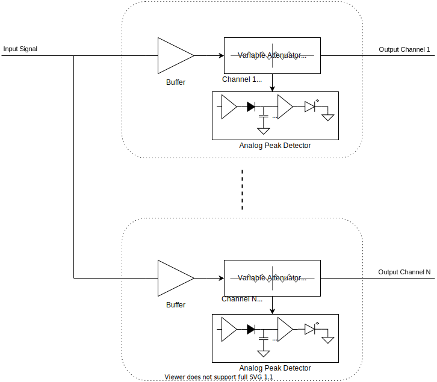
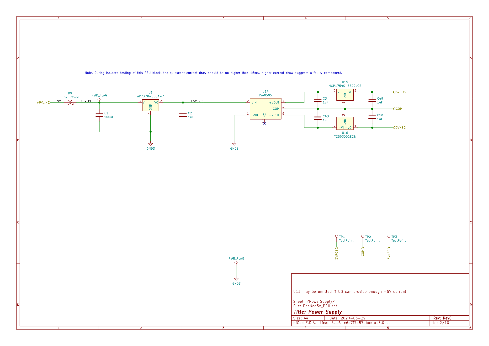
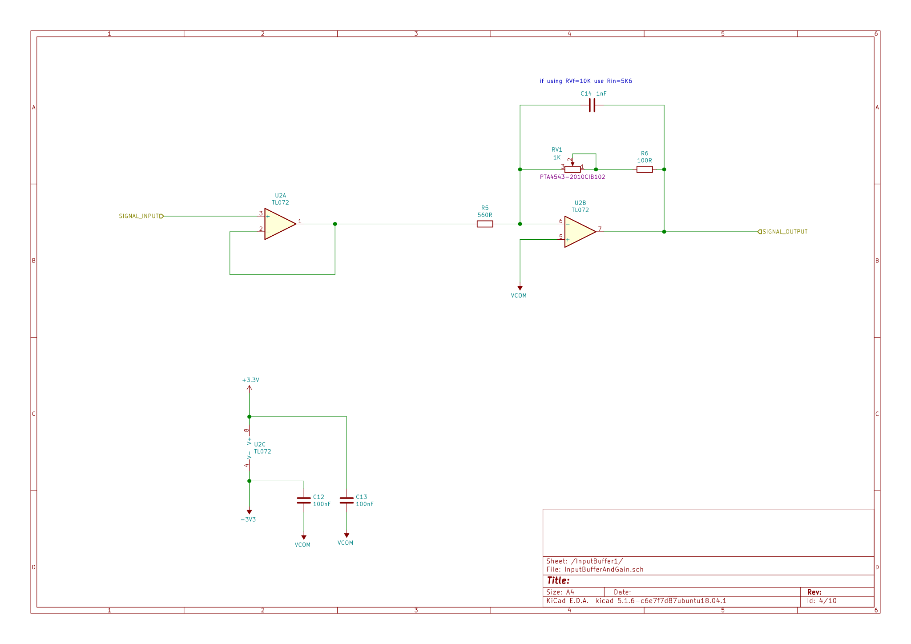
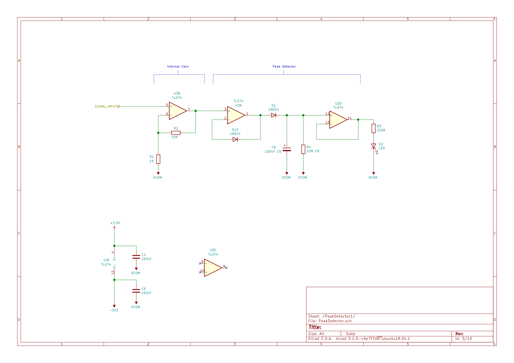
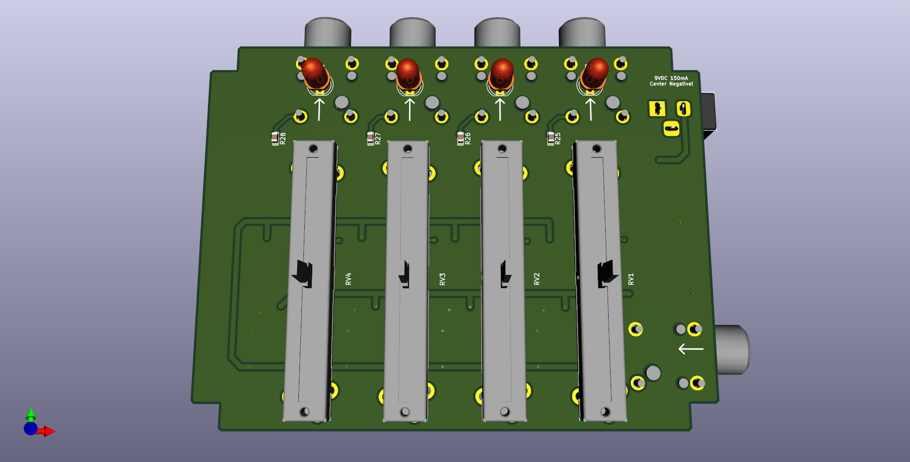
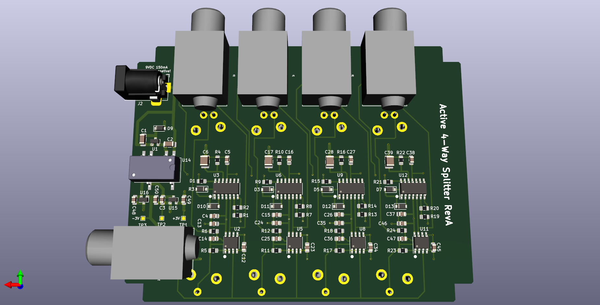

## Active 4-way splitter pedal with analog peak detector

- Analog 1->4 splitter circuit with buffered input and output gain controls.
- Analog LED peak detector per output channel.
- Fits in a Hammond 1590BB enclosure (120mm x 95mm).

### System Overview

### Schematic

##### Top Level

##### Power Supply block

##### Buffer/Attenuator block

##### Peak Detector block

## 3D Renderings

__PCB 3D Render (top view)__

__PCB 3D Render (bottom view)__

