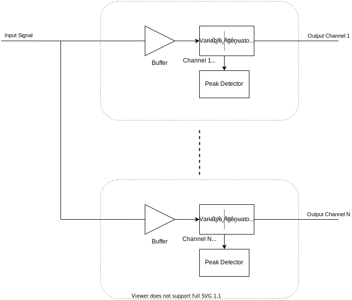
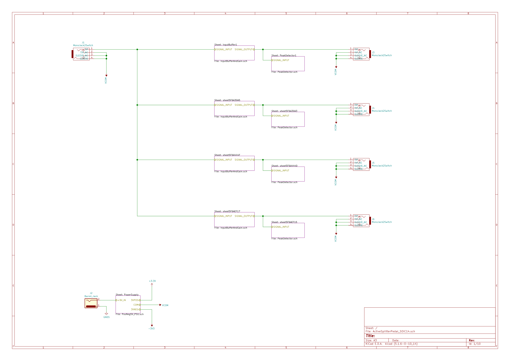
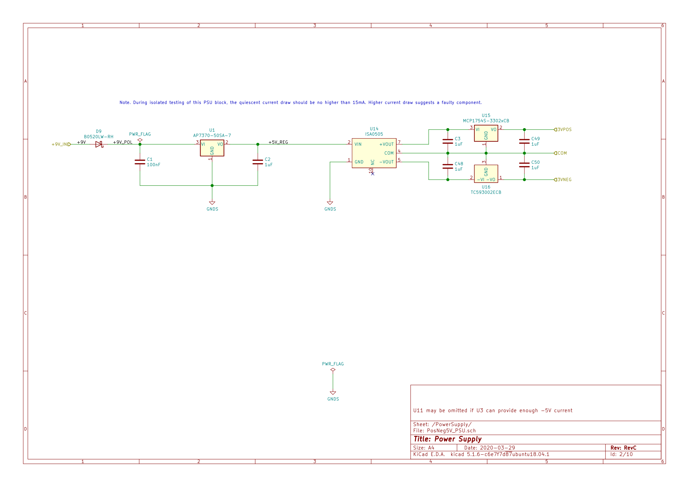
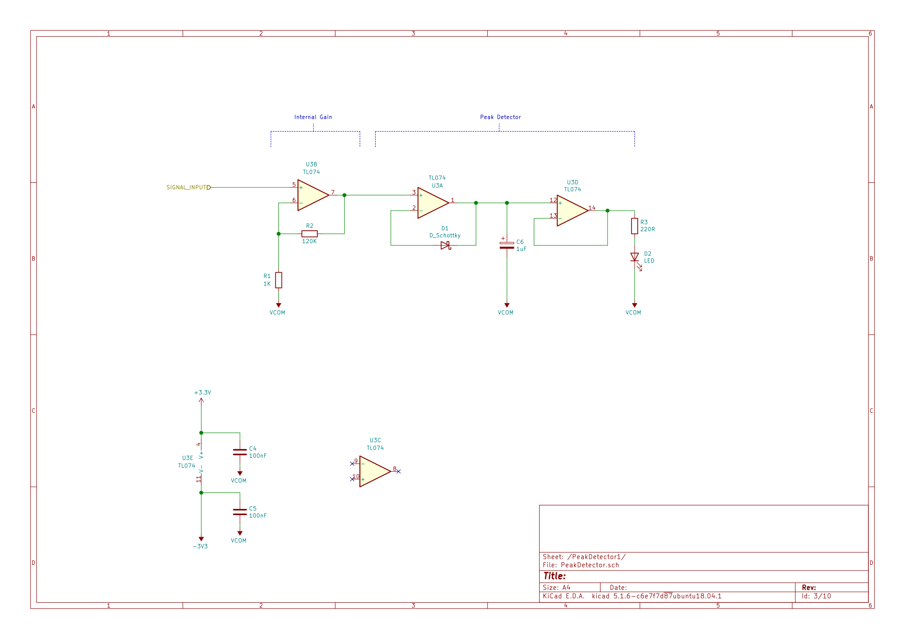
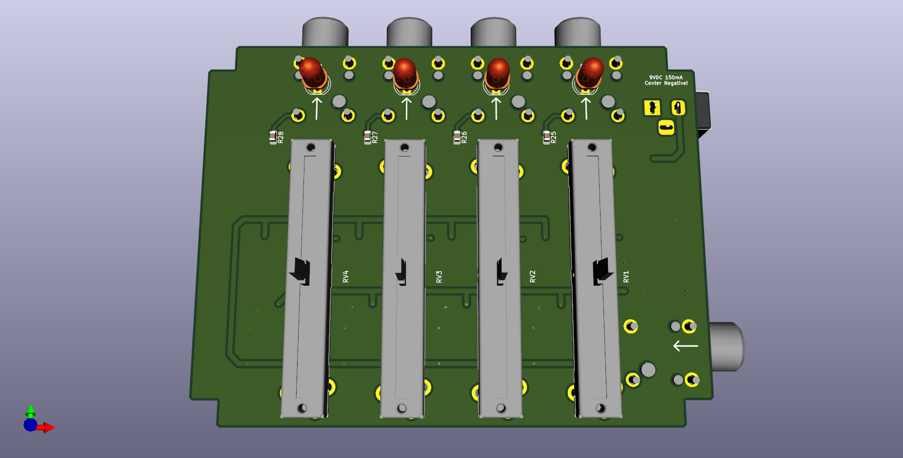
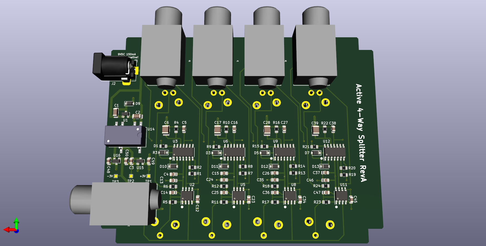

## Active 4-way splitter pedal with analog peak detector

- Slices a single input signal to four identical output signals.
- Buffered input to avoid loading down instrument level signals.
- Gain/attentuation stage per output channel.
- LED peak detector per output channel.
- Fits in a Hammond 1590BB enclosure (120mm x 95mm).
- Fully analog design.

### System Overview

### Schematic

##### Top Level

##### Power Supply block

##### Buffer/Attenuator block

##### Peak Detector block

## 3D Renderings

__PCB 3D Render (top view)__

__PCB 3D Render (bottom view)__

