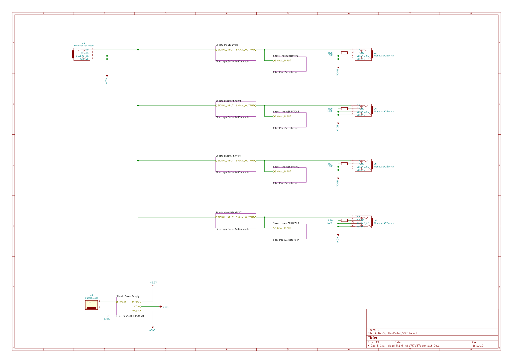

## Active Splitter Guitar Pedal

- 1-to-4 signal splitter
- Analog design for
- per channel active gain/attentuation control
- per channel LED indicates when a signal is present.
- Fits in a Hammond 1590BB enclosure

### System Overview

### Schematic

##### Top Level

##### Power Supply block

##### Buffer/Attenuator block

##### Peak Detector block

## 3D Renderings

__PCB 3D Render (top view)__

__PCB 3D Render (bottom view)__

